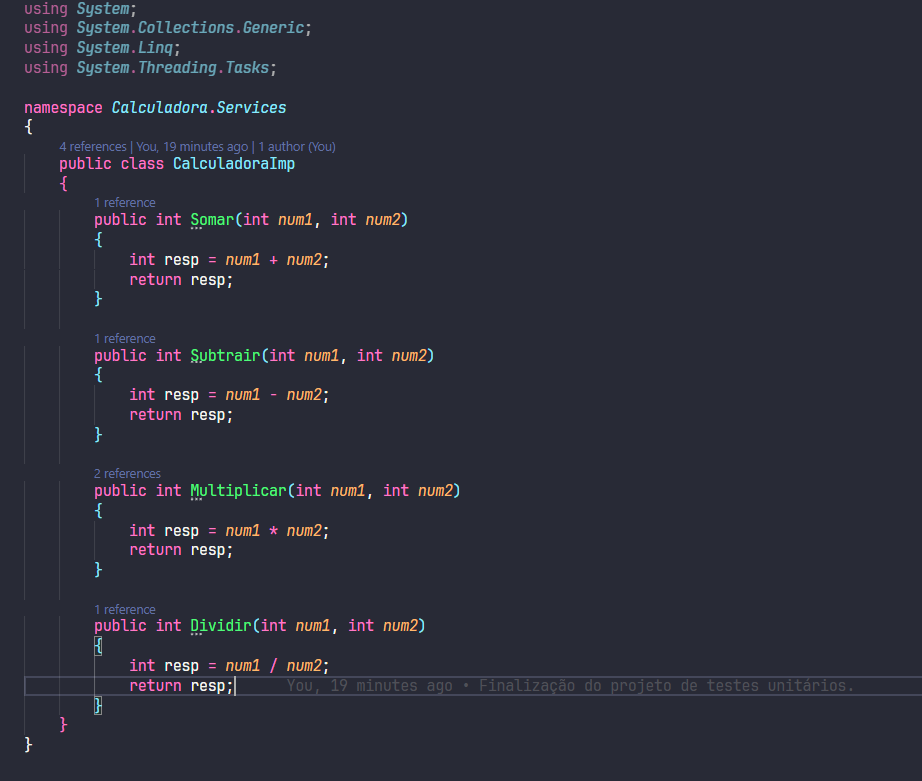
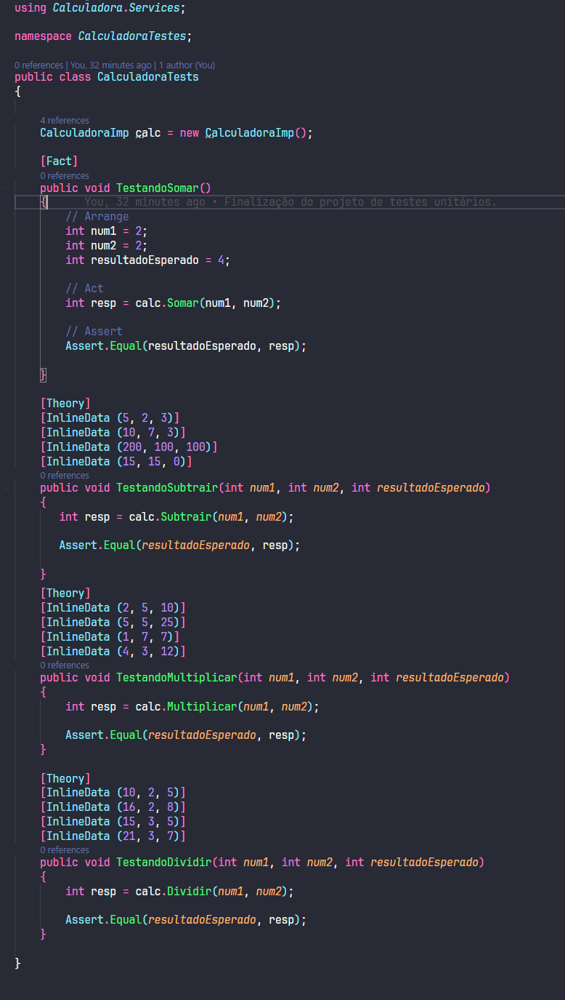

# Calculadora 📟

Este projeto de conclusão de curso usa C# e.NET para fazer uma calculadora com testes unitários. O projeto é uma classe chamada CalculadoraImp que faz operações matemáticas básicas como somar, subtrair, multiplicar e dividir. Eles fazem testes para garantir que essas operações funcionem bem. A biblioteca de testes é a xUnit.

## Estrutura do Projeto

O projeto está dividido em duas partes principais:

- <b>Calculadora.Services:</b> Contém a lógica de negócio da calculadora.
- <b>CalculadoraTestes:</b> Contém os testes unitários que validam o funcionamento da calculadora.

## Detalhamento dos Arquivos

### <b>Calculadora.Services</b>

A classe <b>CalculadoraImp</b> implementa quatro métodos básicos:

- <b>Somar:</b> Retorna a soma de dois números inteiros.
- <b>Subtrair:</b> Retorna a subtração de dois números inteiros.
- <b>Multiplicar:</b> Retorna a multiplicação de dois números inteiros.
- <b>Dividir:</b> Retorna a divisão de dois números inteiros.

### <b>CalculadoraTestes</b>

A classe <b>CalculadoraTests</b> contém os testes unitários para cada operação da classe <b>CalculadoraImp:</b>

- <b>TestandoSomar:</b> Verifica a soma de dois números.
- <b>TestandoSubtrair:</b> Usa o atributo Theory com InlineData para testar múltiplas entradas e saídas esperadas para a subtração.
- <b>TestandoMultiplicar:</b> Usa o atributo Theory com InlineData para testar múltiplas entradas e saídas esperadas para a multiplicação.
- <b>TestandoDividir:</b> Usa o atributo Theory com InlineData para testar múltiplas entradas e saídas esperadas para a divisão.

## Conclusão

Este projeto é base para uma calculadora simples e mostra como usar testes unitários para garantir a qualidade do código. Este projeto introduz boas práticas de desenvolvimento de software com C# e.NET.
